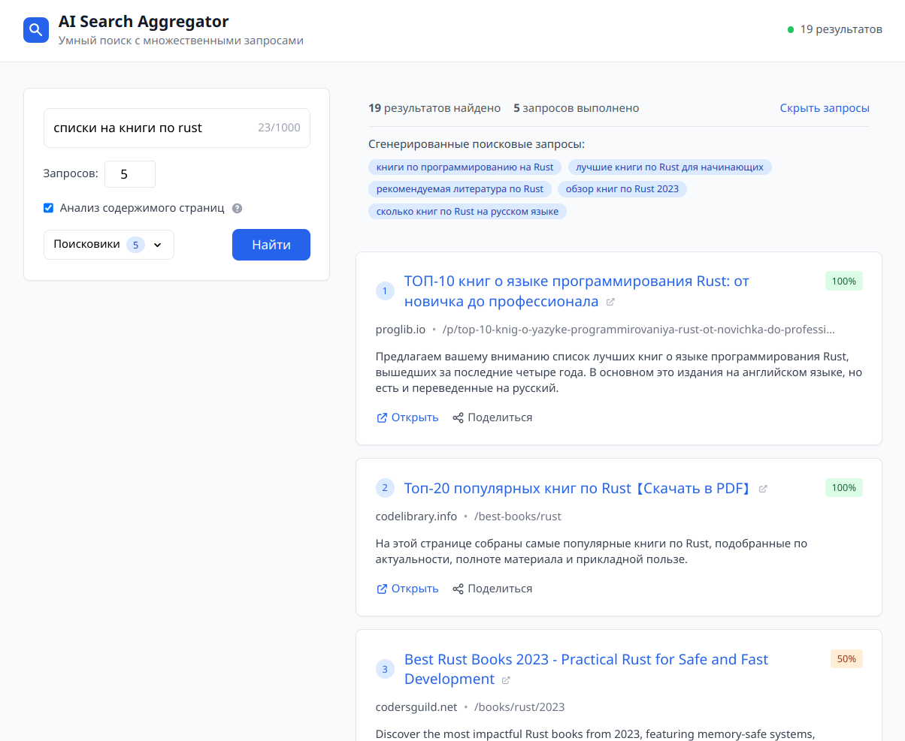

# AI Search Aggregator

A lightweight web application (MVP) that enhances traditional web search by using AI to generate multiple focused queries and execute them in parallel via SearxNG and filtering with AI.

See `deploy/env.example`



## Tech Stack

- **Backend**: Go 1.23, Chi router, Gorilla WebSocket, structured logging
- **Frontend**: Vue 3, TypeScript, Tailwind CSS, Pinia, WebSocket API
- **Search**: SearxNG (self-hosted)
- **AI**: OpenRouter API
- **Deploy**: Docker Compose with WebSocket-enabled Nginx

## Configuration

### Disabling searx_proxy

By default, SearxNG is configured to work through the `searx_proxy` server. If you want to disable proxy usage and make direct requests, edit the [`deploy/searxng_settings.yml`](deploy/searxng_settings.yml) file:

```yaml
outgoing:
  # Comment out or remove the proxies section
  # proxies:
  #   all://:
  #     - http://searx_proxy:8380
  # extra_proxy_timeout: 5.0
  retries: 1
```

## License

MIT

