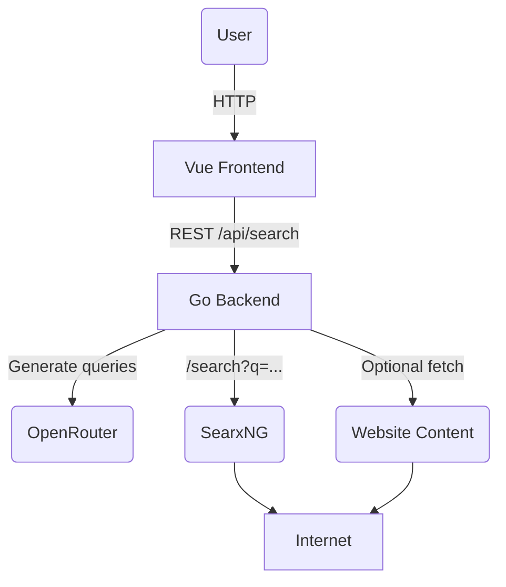

# AI-Powered Multi-Query Search Aggregator

A lightweight web application that boosts traditional web search by letting an LLM create multiple focused queries, then executing them in parallel via Searx. Results are merged, ranked and presented in a clean UI.

---

## 1. Problem Statement
Single keyword searches often miss relevant information. By having an AI generate a set of specific, semantically rich queries, we can surface diverse, higher-quality results with zero extra effort from the user.

## 2. Key Features
1. **LLM-generated queries** – ChatGPT-4o via OpenRouter API
2. **Parallel meta-search** – Uses self-hosted Searx (open-source metasearch) for privacy & control
3. **Configurable** – Users adjust how many queries are generated and whether full-page content should be fetched for deeper matching
4. **Stateless** – No database required for the MVP
5. **One-click deployment** – Everything runs in Docker Compose

## 3. Technology Stack
| Layer      | Tech                                |
|------------|-------------------------------------|
| Frontend   | Vue 3, Vite, TypeScript, Tailwind   |
| Backend    | Go 1.22 (`net/http` + chi or Gin)   |
| AI         | OpenRouter (ChatGPT-4o)             |
| Search     | SearxNG container                   |
| Deployment | Docker + Docker Compose             |

## 4. High-Level Architecture


### Flow
1. User enters a prompt and tweaks settings on the homepage.
2. Frontend calls `POST /api/search` with prompt + options.
3. Backend requests `n` queries from ChatGPT-4o.
4. For each query, backend fires a Searx request (concurrently).
5. If *content mode* is enabled, backend additionally fetches each candidate page and runs a text-match heuristic.
6. Results are deduplicated, ranked, and returned to the UI.

## 5. API Design
### `POST /api/search`
Request body:
```json
{
  "prompt":       "how to learn Go fast",
  "settings": {
    "queries": 5,
    "content_mode": false
  }
}
```
Response body (simplified):
```json
{
  "queries": ["learn go quickly", "go language tutorial", ...],
  "results": [
    {
      "title": "A Tour of Go",
      "url": "https://go.dev/tour",
      "snippet": "An interactive introduction to Go...",
      "score": 0.92
    }
  ]
}
```
Status codes:
- `200 OK` – success
- `400 Bad Request` – validation errors
- `500 Internal Server Error` – upstream failures

### `GET /healthz`
Simple liveness endpoint for orchestrators.

## 6. Environment Variables
| Variable                 | Default | Description                              |
|--------------------------|---------|------------------------------------------|
| `OPENROUTER_API_KEY`     | –       | Auth token for OpenRouter                |
| `SEARX_URL`              | http://searx:8080 | Internal URL of the Searx service |
| `DEFAULT_QUERY_COUNT`    | 5       | Number of AI-generated queries           |
| `CONTENT_MODE_DEFAULT`   | false   | Whether to fetch page content by default |
| `PORT`                   | 8080    | HTTP port for backend                    |

## 7. Concurrency & Performance
- Uses Go `errgroup` to cap concurrent outbound requests (AI, Searx, content fetches)
- Results stream into aggregator; response sent only when all goroutines finish (simple for MVP)
- Timeouts: 30 s overall, 10 s per external request

## 8. Security & Privacy
- No user data persisted
- Searx instance keeps outgoing queries anonymous
- HTTPS termination is expected in the reverse proxy or cloud layer

## 9. Deployment
```bash
# Build & run everything
$ docker compose up --build
```
Services:
- `frontend` – static assets served by Nginx on port 80
- `backend`  – Go API on port 8080 (internal)
- `searx`    – Meta-search engine on port 8080 (internal)

The frontend container can be exposed (or routed) to end-users; backend & searx live on the internal Docker network.

## 10. Roadmap
1. MVP (this spec)
2. Add caching layer (Redis) to avoid duplicate Searx calls
3. Implement vector ranking using embeddings (OpenAI or local model)
4. Introduce user accounts & search history (requires DB)
5. Provide browser extension entry-point

---

© 2025 AI-Powered Search Aggregator